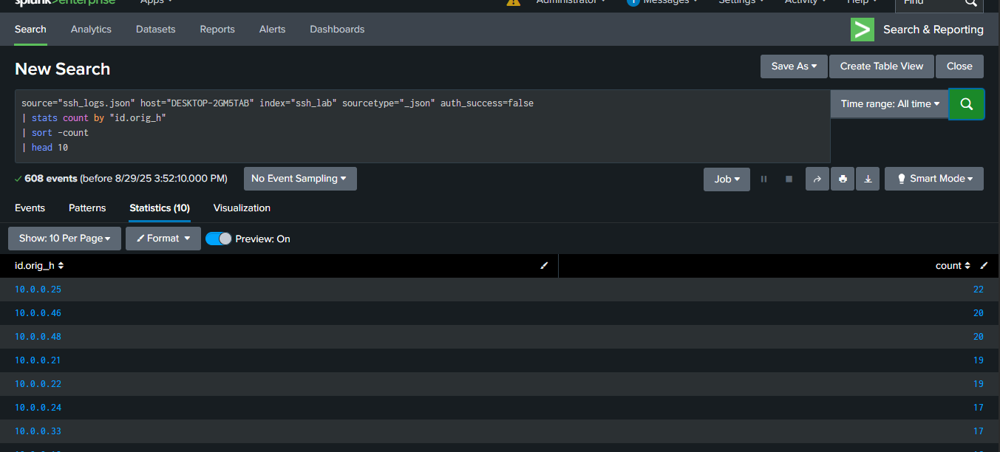
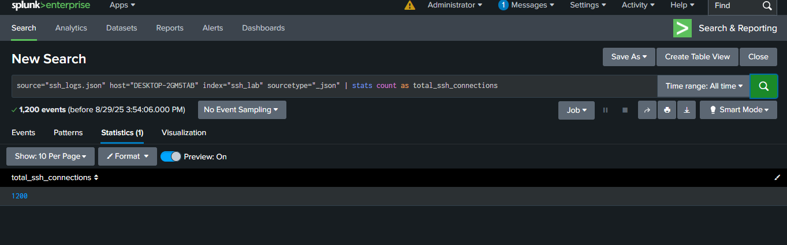
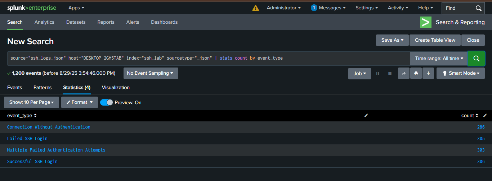

# SSH Log Analysis Project

## Project Description
This project demonstrates the analysis of SSH logs using Splunk . The objective is to ingest Zeek-style JSON-formatted SSH logs, detect successful and failed authentication attempts, and identify unusual activity such as brute force or unauthorized access. This is a key skill for SOC analysts to monitor and secure remote server access.

## Lab Setup
- **Tool**: Splunk.
- **Data Source**: Synthetic Zeek-style SSH logs in JSON format.

## Tasks Performed
### Task 1: Top 10 Endpoints with Failed SSH Login Attempts
- **Query Used**: `index=ssh_lab sourcetype="json" auth_success=false | stats count by "id.orig_h" | sort -count | head 10`
- **Screenshot**: 

### Task 2: Total Number of SSH Connections
- **Query Used**: `index=ssh_lab sourcetype="json" | stats count as total_ssh_connections`
- **Screenshot**: 

### Task 3: Count of All Event Types
- **Query Used**: `index=ssh_lab sourcetype="json" | stats count by event_type`
- **Screenshot**: 

## How to Use
1. Upload the `synthetic_zeek_ssh.json` file to Splunk.
2. Navigate to "Search & Reporting" and run the provided SPL queries.
3. Refer to screenshots in the repository root for expected results.

## Files Included
- `synthetic_zeek_ssh.json`: Sample SSH log file in JSON format.
- Screenshots: `SSH-LOGS-SPLUNK-1.png`, `SSH-LOGS-SPLUNK-2.png`, `SSH-LOGS-SPLUNK-3.png` (stored in repository root).

## Notes
This project was as part of a learning journey to become a SOC analyst. All tasks were performed using Splunk.
